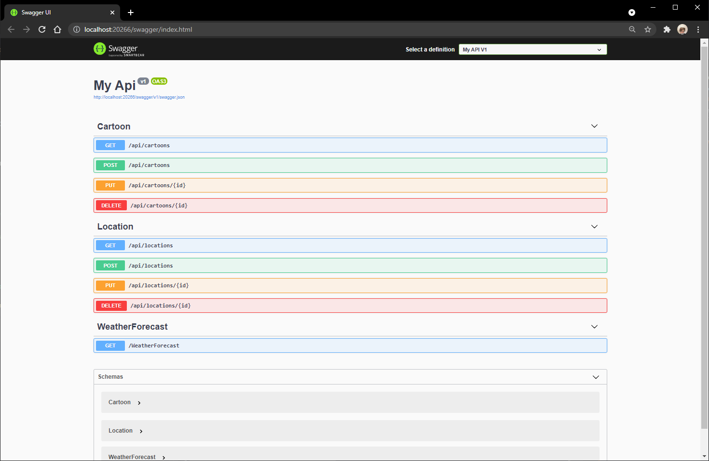
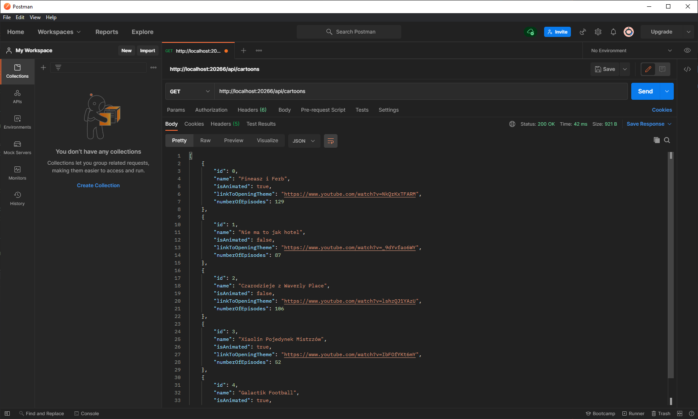

# DateIdeaAPIs 

Date Idea API's, first one handles random locations in Poland, second one manages random childhood cartoons.   Implemented request types for both API's: GET, POST, PUT, DELETE.

## Kredek Lab6

This application was created as a homework for a university coding club [Kredek](https://www.facebook.com/KNKredek)

## Preview 

Swagger view with all of the implemented requests:
 

 
Example of a GET request from Postman:
 

